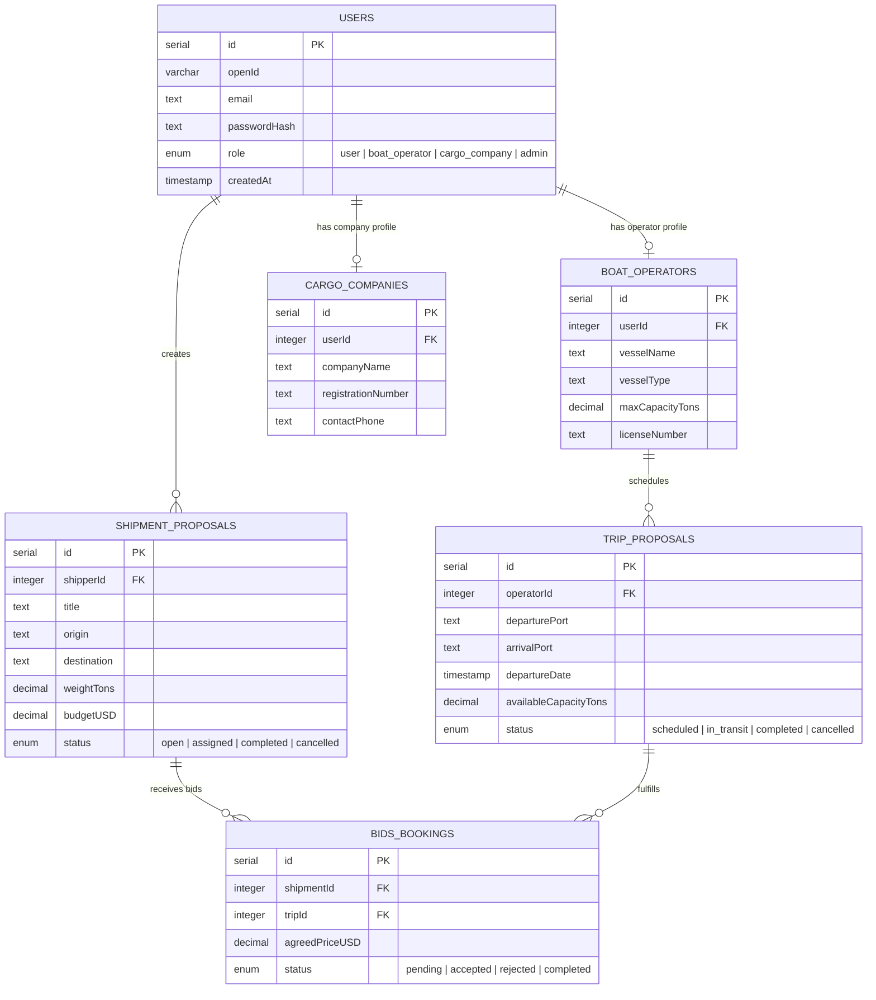

# Database Schema Expansion & Supabase Integration Plan

This document outlines the architectural plan for transitioning the Waterway database from MySQL to **PostgreSQL (Supabase)** and expanding the schema to replace mock data with live, user-generated network data.

---

## 1. Migration Overview: MySQL to PostgreSQL (Supabase)

To connect directly to Supabase, Drizzle is configured to use `drizzle-orm/pg-core` and the `postgres` driver instead of `mysql2`.

### Key Changes
- **Dialect:** MySQL (`mysqlTable`, `mysqlEnum`) $\rightarrow$ PostgreSQL (`pgTable`, `pgEnum`).
- **Data Types:** `int().autoincrement()` $\rightarrow$ `serial()`, `varchar` $\rightarrow$ `varchar`/`text`, `timestamp` $\rightarrow$ `timestamp({ withTimezone: true })`.
- **Database Driver:** `postgres` connection pool with `drizzle-orm/postgres-js` connected to Supabase's `DATABASE_URL`.

---

## 2. Expanded Database Tables

The expanded schema introduces dedicated tables for each user type and live operational entity.

---

## 3. Table Definitions & Relationships

### A. `users` (Core Auth & Identity)
Central account table supporting authentication and role assignment.
- `id`: Primary key (`serial`)
- `openId`: OAuth identifier (`varchar(64)`, unique)
- `name`: Full display name (`text`)
- `email`: Unique user email (`text`, unique)
- `passwordHash`: Password hash for direct email authentication (`text`, nullable for OAuth)
- `loginMethod`: Authentication provider (`varchar(64)`)
- `role`: Role enum (`'user'`, `'boat_operator'`, `'cargo_company'`, `'admin'`)
- `createdAt`, `updatedAt`, `lastSignedIn`: Timestamps with time zone

### B. `boat_operators` (Operator Profiles)
Stores boat captain and fleet details linked to a user account.
- `id`: Primary key (`serial`)
- `userId`: Foreign key referencing `users.id` (on delete cascade)
- `vesselName`: Name of the boat/barge
- `vesselType`: Type of vessel (e.g., Cargo Barge, Speedboat, Ferry, Tugboat)
- `maxCapacityTons`: Maximum freight capacity (`numeric(10, 2)`)
- `licenseNumber`: Commercial boat license registration number
- `isVerified`: Verification status (`boolean`, default: `false`)

### C. `cargo_companies` (Logistics Profiles)
Stores business details for cargo & shipping companies.
- `id`: Primary key (`serial`)
- `userId`: Foreign key referencing `users.id` (on delete cascade)
- `companyName`: Registered business name
- `registrationNumber`: Tax / Business ID number
- `contactPhone`: Operations contact phone number

### D. `shipment_proposals` (Live Cargo Requests)
Created by cargo companies or standard shippers requesting freight movement.
- `id`: Primary key (`serial`)
- `shipperId`: Foreign key referencing `users.id` (on delete cascade)
- `title`: Short summary of cargo (e.g., "50 Tons Agricultural Produce")
- `origin`: Origin port / location
- `destination`: Destination port / location
- `weightTons`: Freight weight (`numeric(10, 2)`)
- `cargoType`: Category (e.g., Dry Goods, Liquid, Refrigerated, Containers)
- `budgetUSD`: Estimated budget or target price (`numeric(10, 2)`)
- `status`: State of request (`'open'`, `'assigned'`, `'completed'`, `'cancelled'`)

### E. `trip_proposals` (Live Boat Routes)
Posted by boat operators advertising scheduled departures and available capacity.
- `id`: Primary key (`serial`)
- `operatorId`: Foreign key referencing `boat_operators.id` (on delete cascade)
- `departurePort`: Starting waterway port
- `arrivalPort`: Target waterway port
- `departureDate`: Scheduled departure timestamp with timezone
- `availableCapacityTons`: Remaining cargo capacity on this journey (`numeric(10, 2)`)
- `passengerSeats`: Available passenger seats (if applicable, integer)
- `status`: Journey status (`'scheduled'`, `'in_transit'`, `'completed'`, `'cancelled'`)

### F. `bids_bookings` (Contract & Matching)
Connects a shipment proposal with a specific trip proposal.
- `id`: Primary key (`serial`)
- `shipmentId`: Foreign key referencing `shipment_proposals.id` (on delete cascade)
- `tripId`: Foreign key referencing `trip_proposals.id` (on delete cascade)
- `agreedPriceUSD`: Final agreed transport cost (`numeric(10, 2)`)
- `status`: Booking status (`'pending'`, `'accepted'`, `'rejected'`, `'completed'`)

---

## 4. Execution Status

- [x] **1. Install PostgreSQL Driver:** Added `postgres` dependency to `package.json`.
- [x] **2. Update Schema (`drizzle/schema.ts`):** Replaced MySQL primitives with PostgreSQL primitives (`drizzle-orm/pg-core`), created enums, table schemas, relationships, and inferred types.
- [x] **3. Configure Database Connection (`server/db.ts`):** Initialized `drizzle` with `postgres(process.env.DATABASE_URL)` connection pool and query helpers.
- [x] **4. Generate Migrations:** Generated PostgreSQL migration `drizzle/0000_same_umar.sql` with all 6 tables, types, and constraints via `drizzle-kit generate`.
- [x] **5. Update API Procedures (`server/routers.ts`):** Added tRPC endpoints for `shipments`, `trips`, `operators`, `cargoCompanies`, and `bookings`.
- [ ] **6. Apply to Live Supabase Instance:** Provide your Supabase `DATABASE_URL` in environment / `.env` and run `pnpm db:push` (or execute the generated SQL migration directly in Supabase SQL Editor).
